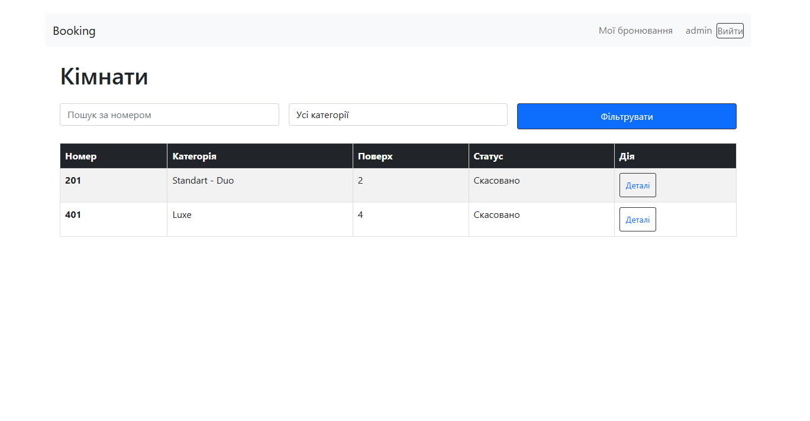

# Booking Rooms
Booking Rooms is a web application designed for organizing and managing electronic room bookings in a hotel.
Users can register, log in, browse available rooms, and make reservations by selecting dates, room search and filtering functionality.
The administrator can manage bookings and users through the Django admin panel.



## Django_Project
```
booking_site/                # Main Django project configuration
├── settings.py              # Global project settings (DB, apps, static files, etc.)
├── urls.py                  # Root URL configuration
├── asgi.py / wsgi.py        # ASGI/WSGI entry points for deployment
└── __init__.py              # Marks this directory as a Python package
core/                        # Main application (app) of the project
├── admin.py                 # Registers models in the Django admin panel
├── apps.py                  # App configuration
├── models.py                # Database models (rooms, bookings, users)
├── views.py                 # Main request handling logic
├── urls.py                  # App-level URL configuration
├── forms.py                 # Django forms for authentication and booking
├── tests.py                 # Unit tests
│
├── static/core/css/         # Static files (CSS, images, scripts)
├──styles.css           # Main stylesheet
│
├── templates/core/          # HTML templates for the app
├── base.html            # Base layout template
├── room_list.html       # Page with list of available rooms
├── room_detail.html     # Room detail page
├── my_bookings.html     # User's bookings page
└── auth/                # Authentication templates
    ├── login.html       # Login page
    └── register.html    # Registration page
│
├── db.sqlite3                   # Local SQLite database
├── manage.py                    # Django management script
├── .gitignore                   # Git ignore file
└── README.md                    # Project documentation
```
## Main Features

* User registration and authentication.

* View a list of available rooms.

* View detailed room information.

* Create a booking with date selection.

* View personal bookings.

* Admin panel for managing rooms, users, and bookings.

## How to Run the Project

1. Clone the repository:
```sh
    git clone <repository-link>
```
2. Navigate to the project directory:
```sh
    cd Django_Project
```
3. Activate the virtual environment:
```sh
    On Windows:
        venv\Scripts\activate
```
```sh
    On Linux/macOS:
        source venv/bin/activate
```
4. Run the development server:
```sh
    python manage.py runserver
```
5. Open your browser and go to:
```sh
    http://127.0.0.1:8000/
```
